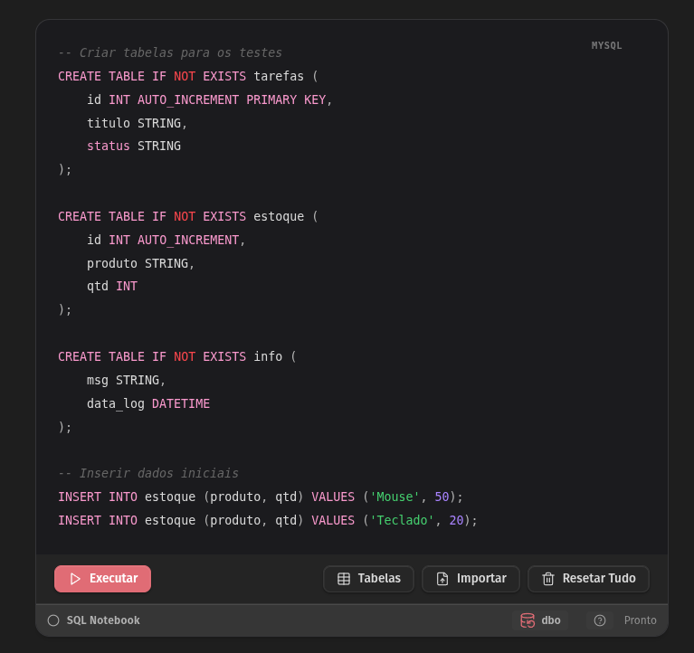
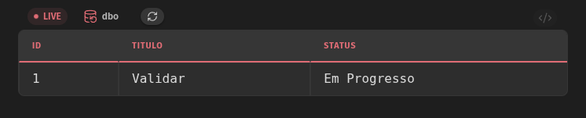
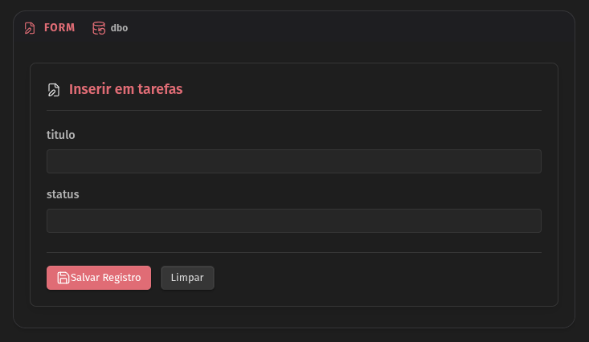

# 🗄️ SQL Notebook for Obsidian

**Transform your Obsidian Vault into a powerful local SQL Database Manager.**


> "The missing link between knowledge management and structured data. Execute queries, manage local databases, and visualize results without leaving your notes."

[](https://github.com/DiegoSmk/obsidian-sql/releases)
[](https://github.com/DiegoSmk/obsidian-sql/releases)

---

## 🌟 Why simple notes aren't enough?

Sometimes you need more than just text. You need structure.
- **Learning SQL?** Practice directly in your study notes.
- **Managing Project Data?** Create light databases for tasks, inventories, or logs.
- **Data Analysis?** Import CSVs, query them with SQL, and export the results.

**SQL Notebook** brings a fully functional, serverless SQL engine (AlaSQL) right inside Obsidian. No Docker, no external servers, just pure local privacy.

## ✨ Key Features

### 1. 🚀 Native SQL Execution
Write standard SQL code blocks (` ```mysql `) and execute them instantly.
- **In-Memory Speed**: Powered by AlaSQL.
- **Dynamic Workbench**: Every code block becomes an interactive mini-app.
- **Syntax Highlighting**: Beautiful rendering in Live Preview and Reading Mode.

### 2. 🌍 Internationalization (i18n) - *New in v0.5.0*
Fully translated and localized for a global audience.
- 🇺🇸 English
- 🇧🇷 Português (Brasil)
- 🇪🇸 Español
- 🇩🇪 Deutsch
- 🇫🇷 Français
- 🇯🇵 日本語
- 🇰🇷 한국어
- 🇨🇳 简体中文

### 3. 🛡️ Multi-Database Workbench
Don't clutter your global namespace. Create and switch between isolated environments using the **Workbench**.
- **Context Switching**: Work on `project_alpha` while keeping `personal_finance` safe.
- **Visual Management**: See tables, row counts, and schema details in the Settings UI.
- **Privacy First**: All data lives locally in your Obsidian storage.

### 4. 📝 Dynamic Forms & Parameters
Turn static queries into interactive apps.
- **Parameters**: Use `:variable` syntax to auto-generate input fields.
- **SQL Forms**: Use the special `FORM` syntax to create data entry interfaces.

### 5. 🔌 CSV Import/Export
- **Import**: Drag & drop CSV files to query them as tables.
- **Export**: Save your query results back to CSV or Markdown tables.
- **Snapshots**: Capture query results including charts or tables as images to paste into your notes.

---

## 🚀 Quick Start Guide

### 1. Installation
1. Search for **"SQL Notebook"** in Obsidian Community Plugins.
2. Click **Install** and **Enable**.

### 2. Your First Query
Create a code block in any note using the language `mysql`:



```mysql
-- Create a table
CREATE TABLE tasks (id INT, title STRING, status STRING);

-- Insert some data
INSERT INTO tasks VALUES (1, 'Install Plugin', 'Done'), (2, 'Try Forms', 'Doing');

-- Query it
SELECT * FROM tasks WHERE status = 'Doing';
```

Click the **▶ Run** button. A beautiful table will render below your code.

### 3. Interactive Features

#### ⚡ Live Mode
Want a dashboard that updates automatically? Just add `LIVE` before your SELECT statement.
The results will refresh whenever the database changes.



````markdown
```mysql
LIVE SELECT status, COUNT(*) as count FROM tasks GROUP BY status;
```
````

#### 📝 SQL Forms
Need a quick way to insert data without writing INSERT queries manually?
Use the `FORM` keyword to generate an automatic input UI based on your table schema.



````markdown
```mysql
FORM tasks;
```
````
This renders a clean form with fields for `id`, `title`, and `status`. Fill it out and click "Save" to insert a row instantly!

#### � Parameterized Queries
Make your queries reuseable by adding variables with `:name`. 
A text box will appear for you to type values dynamically.

````markdown
```mysql
-- @ Filter by Status
SELECT * FROM tasks WHERE status = :currentStatus;
```
````
*(Pro Tip: The `-- @` comment automatically collapses the code block, showing only the UI!)*

### 4. Comment Markers
Organize your notebook with special comment syntax:
- `!` : **Alert** (Red highlight) -> `-- ! Critical Update`
- `?` : **Question** (Yellow/Blue highlight) -> `-- ? Needs Review`
- `*` : **Favorite** (Star highlight) -> `-- * Most Used Query`
- `@` : **Auto-Collapse** -> `-- @ Collapsed View`

---

## 🤝 Contributing

We welcome contributions! Whether it's a new translation language or a core feature:
1. Fork the project.
2. Create your feature branch (`git checkout -b feature/AmazingFeature`).
3. Commit your changes.
4. Open a Pull Request.

**Developers:** Check out our [Development Guidelines](DEVELOPMENT_GUIDELINES.md).

## 📄 License
MIT License. Free and Open Source forever.

---
<div align="center">
  <i>Made with ❤️ by Diego Pena</i>
</div>
